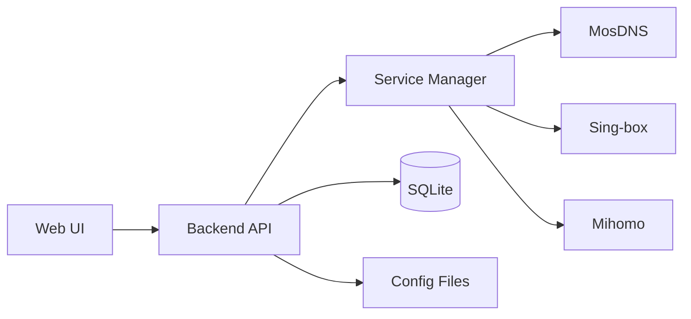

# Architecture

This page summarizes the current implementation in `/Users/doumao/code/github/msm`.

## Overview

- **Frontend**: React + Vite
- **Backend**: Go + Gin
- **Service Layer**: unified control for MosDNS / Sing-box / Mihomo
- **Data & Config**: SQLite and service config files

## Default Paths

- Config: `/root/.msm`
- Data: `/root/.msm/data`
- Logs: `/root/.msm/logs`
