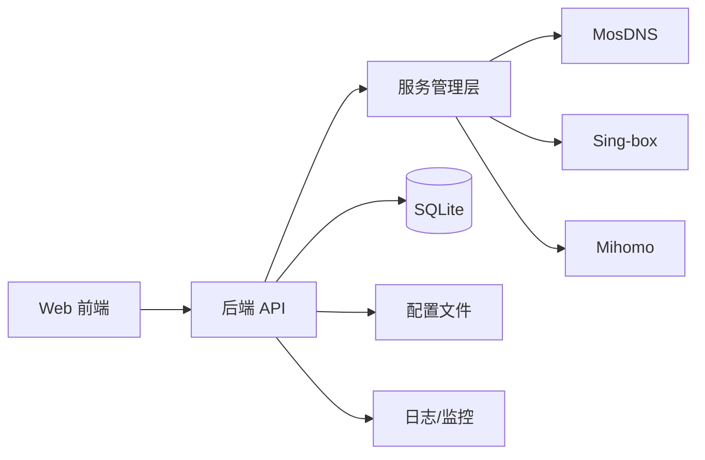

# 架构设计

本页基于 `/Users/doumao/code/github/msm` 的当前实现整理，描述 MSM 的核心组件与数据流。

## 总体架构

MSM 由 Web 前端、后端 API、服务管理层和三大核心服务组成：

- **前端**：React + Vite，提供可视化管理界面
- **后端**：Go + Gin，提供 REST API 与 WebSocket
- **服务管理层**：统一管理 MosDNS、Sing-box、Mihomo 的启动、停止、重启与状态采集
- **配置与数据**：配置文件与 SQLite 数据库存放在 MSM 数据目录

## 核心模块职责

- **服务控制**：统一处理安装、启动、停止、重启、升级与状态检测
- **配置管理**：在线编辑配置文件，支持版本历史与回滚
- **权限与安全**：用户登录、JWT 鉴权、操作审计
- **监控与日志**：系统资源监控与服务日志流式查看

## 关键路径约定（默认）

- **配置目录**：`/root/.msm`
- **数据目录**：`/root/.msm/data`
- **日志目录**：`/root/.msm/logs`

> 说明：路径可通过 MSM 参数或配置目录进行调整。

## 数据流简述

1. 用户在 Web 前端发起操作（如保存配置、重启服务）。
2. 前端调用后端 API，后端进行鉴权与参数校验。
3. 后端写入配置或数据库，并调用服务管理层执行操作。
4. 服务状态与日志通过 WebSocket 推送到前端。

## 运行依赖

- **进程管理**：优先使用 systemd（`msm service install`）
- **可选**：supervisord，用于服务进程托管与日志收集

## 与 DNS/代理体系的关系

- MosDNS 负责 DNS 分流与缓存
- Sing-box / Mihomo 负责代理转发与规则匹配
- MSM 负责统一编排与状态监控
